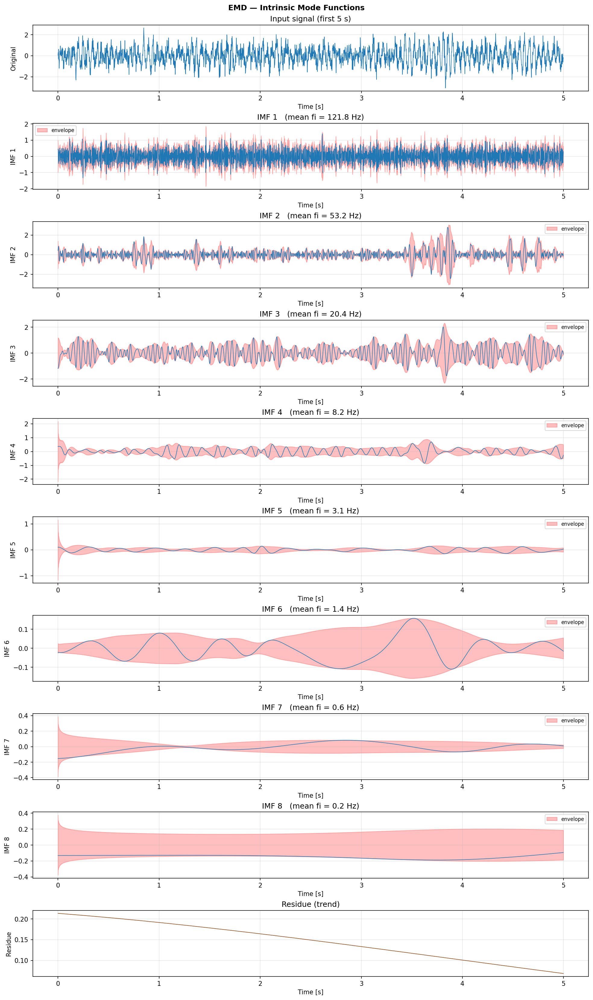
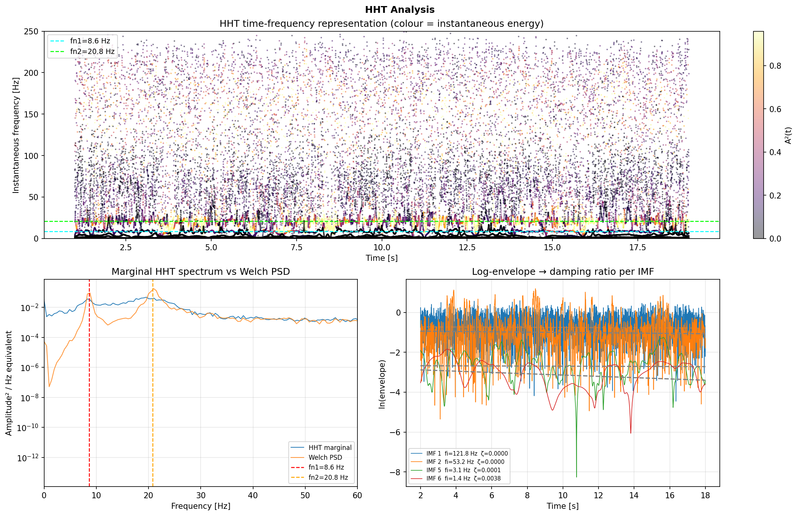

# EMD / HHT

Empirical Mode Decomposition and the Hilbert-Huang Transform.

EMD adaptively decomposes a signal into **Intrinsic Mode Functions (IMFs)** without any a-priori basis. Each IMF satisfies:

1. The number of extrema and zero-crossings differ by at most one.
2. The mean of the upper and lower envelopes is everywhere near zero.

The HHT applies the Hilbert transform to each IMF to produce a fully adaptive time-frequency representation free of cross-term artifacts.

**Reference:** Huang et al. (1998), *Proc. R. Soc. London A*, 454, 903–995.

---

## Workflow

```python
import dspkit as dsp

# 1. Decompose
imfs, residue = dsp.emd(x, max_imfs=8)

# 2. Hilbert-Huang Transform
envs, inst_freqs = dsp.hht(imfs, fs)

# 3. Marginal spectrum
freq_bins, marginal = dsp.hht_marginal_spectrum(envs, inst_freqs, fs, n_bins=512)
```

Reconstruction is exact: `imfs.sum(axis=0) + residue == x` (within floating-point tolerance).





---

::: dspkit.emd.emd

---

::: dspkit.emd.hht

---

::: dspkit.emd.hht_marginal_spectrum
