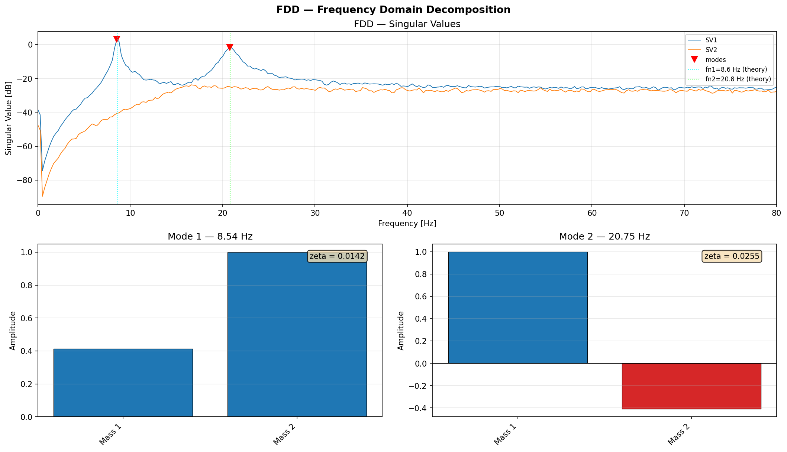

# FDD — Frequency Domain Decomposition

Operational Modal Analysis via Frequency Domain Decomposition. Identifies natural frequencies, mode shapes, and damping ratios from output-only (ambient vibration) data.

---

::: dspkit.fdd.fdd_svd

---

::: dspkit.fdd.fdd_peak_picking

---

::: dspkit.fdd.fdd_mode_shapes

---

::: dspkit.fdd.efdd_damping
