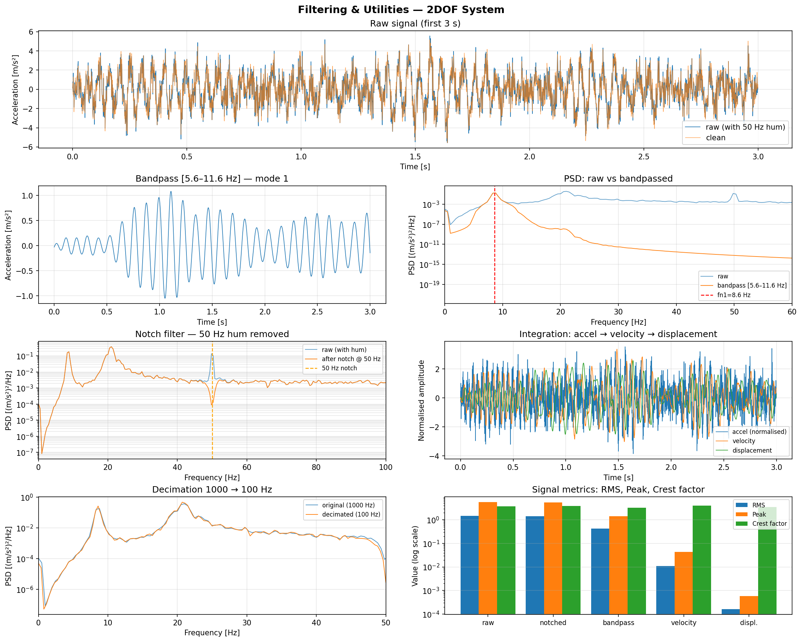

# Filters

Zero-phase IIR filtering and decimation.

All filters use Butterworth SOS design (`scipy.signal.butter` + `sosfiltfilt`) for numerical stability and zero group-delay distortion — appropriate for offline SHM analysis where phase matters.

!!! note "Zero-phase vs causal"
    `zero_phase=True` (default) applies the filter twice (forward + backward), doubling the effective order and producing exactly zero phase shift. Set `zero_phase=False` for causal (real-time) processing.

---

::: dspkit.filters.lowpass

---

::: dspkit.filters.highpass

---

::: dspkit.filters.bandpass

---

::: dspkit.filters.bandstop

---

::: dspkit.filters.notch

---

::: dspkit.filters.decimate
