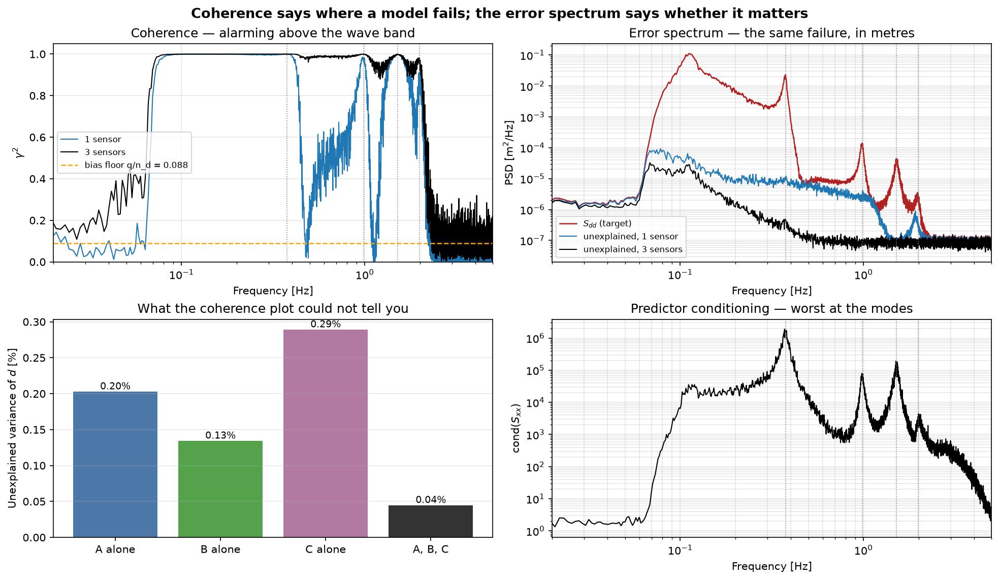

# FRF and Prediction

Frequency response function estimation for one input or several, and the
question that follows from it: given some channels, how much of another one
can any linear model account for?

`frf` gives the H1/H2/H3 estimators with coherence alongside, because coherence
is what says whether either number is worth reading. `frf_mimo` solves the
several-inputs case and returns the condition number of the input spectral
matrix, which is the diagnostic that matters when inputs are correlated.

`error_spectrum` turns the same machinery around. Instead of asking what the
transfer function is, it asks what is left over: the residual spectrum of the
best linear predictor, in the target's own units. Report that rather than the
coherence alone — coherence says *where* a model fails, the error spectrum says
*how much that matters*, and the two often disagree.

---

::: dspkit.frf.frf

---

::: dspkit.frf.frf_mimo

---

::: dspkit.frf.error_spectrum
