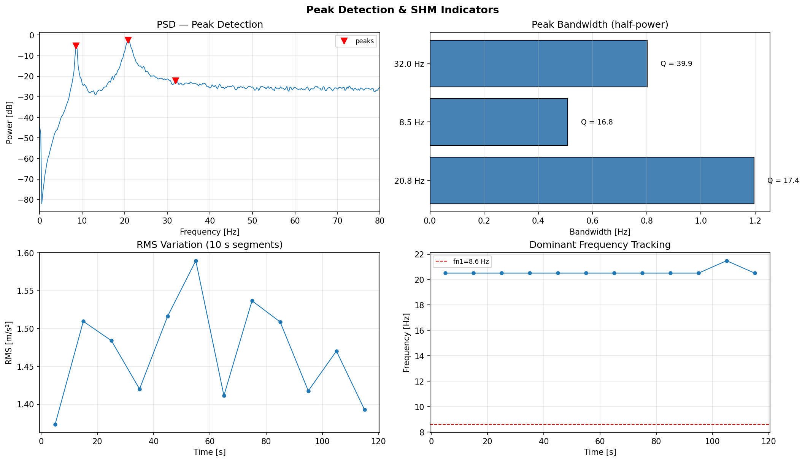

# Peaks

Peak detection and characterisation tools for spectral data: find peaks, measure bandwidth and Q-factor, and identify harmonic series.

---

::: dspkit.peaks.find_peaks

---

::: dspkit.peaks.peak_bandwidth

---

::: dspkit.peaks.find_harmonics
