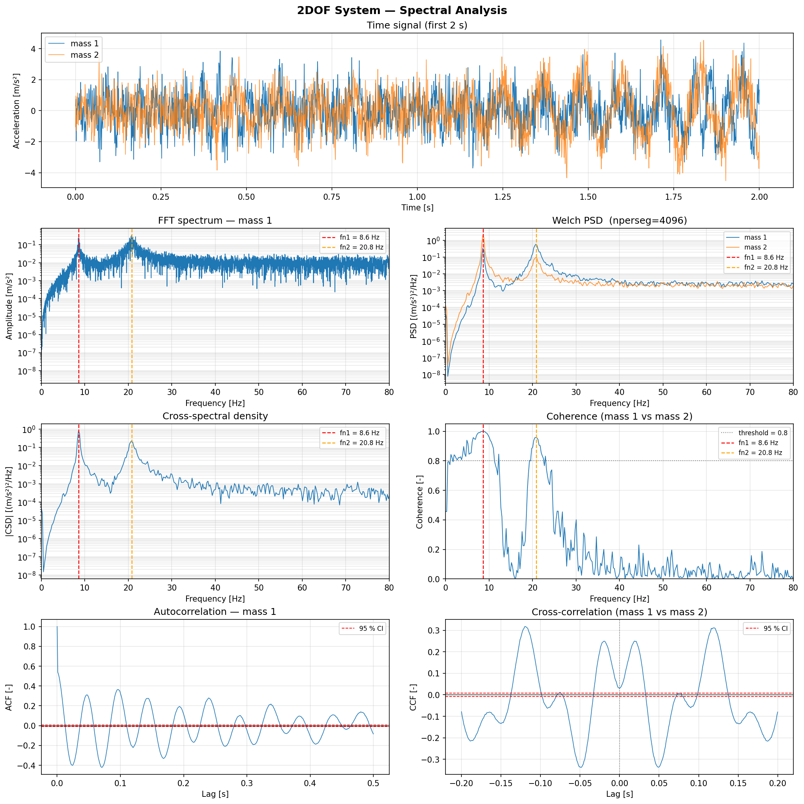

# Spectral

Spectral analysis functions: FFT amplitude spectrum, power spectral density, cross-spectral density, coherence, autocorrelation, and cross-correlation.

All estimators use `scipy.signal` under the hood with engineering-friendly defaults (Hann window, density scaling, mean detrending).

---

::: dspkit.spectral.fft_spectrum

---

::: dspkit.spectral.psd

---

::: dspkit.spectral.csd

---

::: dspkit.spectral.coherence

---

::: dspkit.spectral.autocorrelation

---

::: dspkit.spectral.cross_correlation
