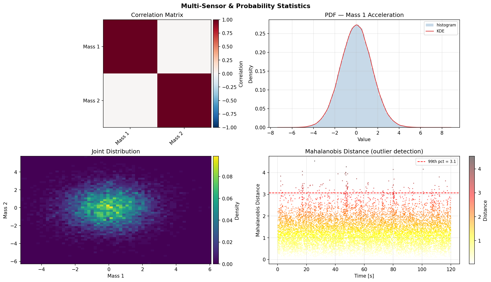

# Statistics

Probability density estimation and joint statistics for signal characterisation: KDE, histograms, joint distributions, covariance, and Mahalanobis distance.

---

::: dspkit.statistics.pdf_estimate

---

::: dspkit.statistics.histogram

---

::: dspkit.statistics.joint_histogram

---

::: dspkit.statistics.covariance_matrix

---

::: dspkit.statistics.mahalanobis
