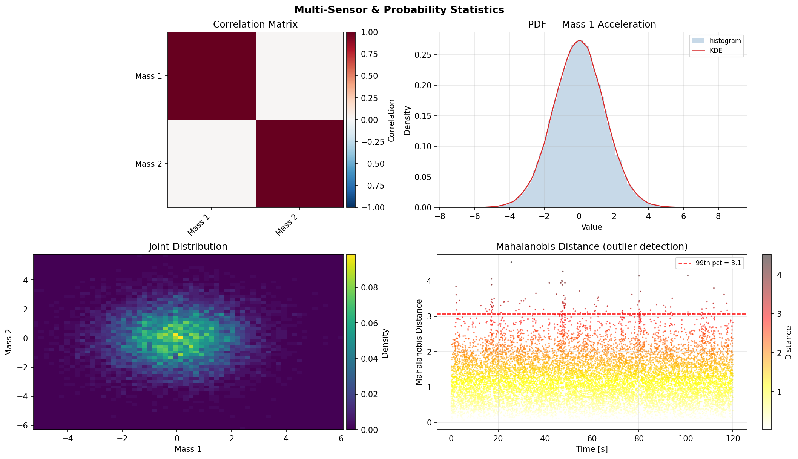

# Statistics

Probability density estimation and joint statistics for signal characterisation: KDE, histograms, joint distributions, covariance, Mahalanobis distance, normality assessment, and mutual information for dependence that coherence cannot see.

---

::: dspkit.statistics.pdf_estimate

---

::: dspkit.statistics.histogram

---

::: dspkit.statistics.joint_histogram

---

::: dspkit.statistics.covariance_matrix

---

::: dspkit.statistics.mahalanobis

---

::: dspkit.statistics.qq_normal

---

::: dspkit.statistics.normality

---

::: dspkit.statistics.mutual_information

---

::: dspkit.statistics.mi_significance
