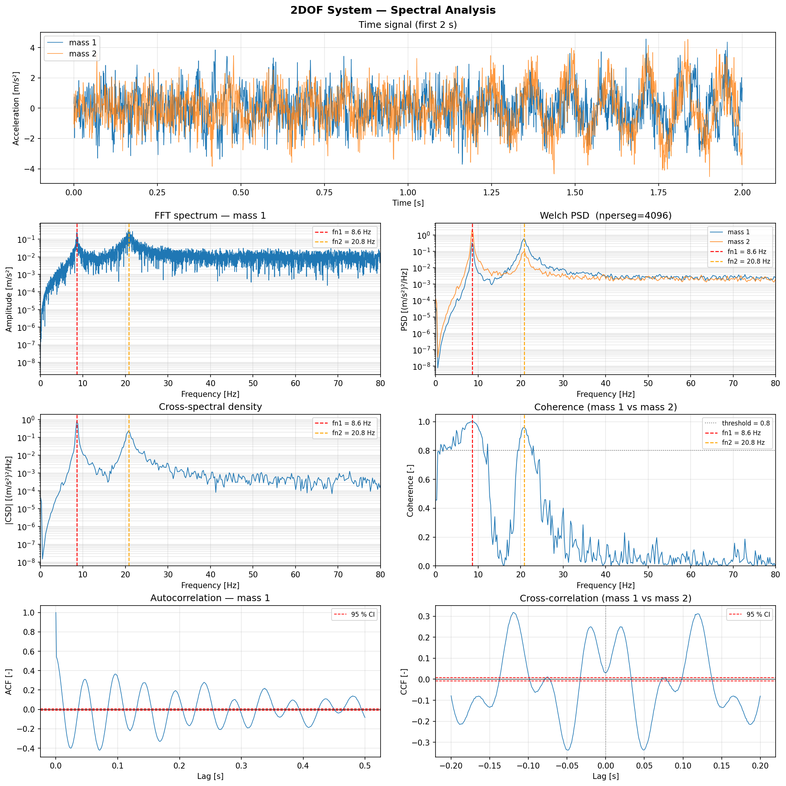
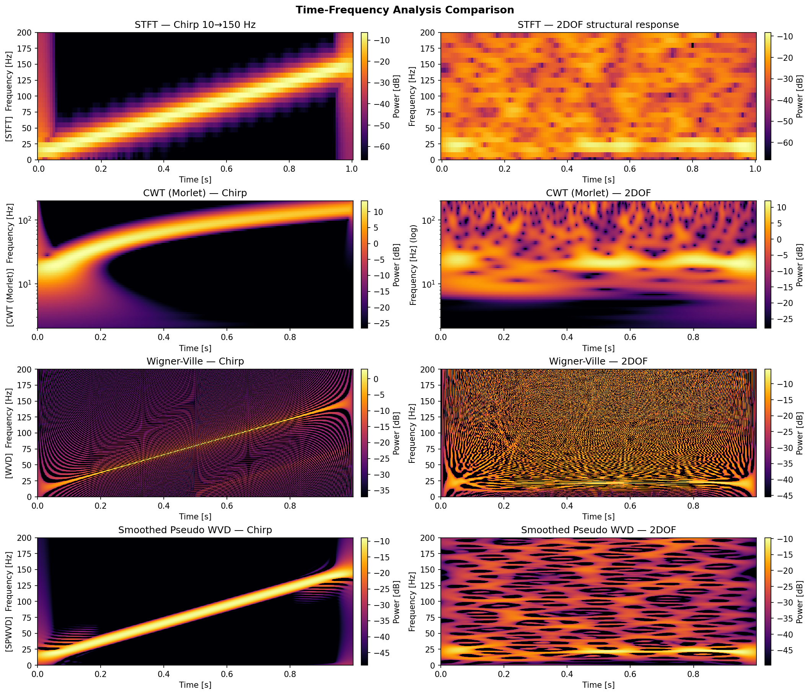

# DSPkit

**A lightweight digital signal processing toolkit for time series data.**

DSPkit provides a clean, function-based API for everyday signal processing: spectral estimation, filtering, time-frequency analysis, and adaptive decomposition. It is general-purpose — nothing in it assumes a domain — though the modal analysis it also carries (FDD/EFDD) comes from vibration and structural health monitoring work. It depends only on NumPy, SciPy, and Matplotlib — no heavy ML frameworks or extra wavelet libraries required.

---

## Modules at a glance

| Module | What it does |
|---|---|
| [`spectral`](api/spectral.md) | Three PSD estimators — Welch, Blackman-Tukey and autoregressive — plus FFT spectrum, CSD, coherence, autocorrelation, and advice on the segment length they all depend on |
| [`filters`](api/filters.md) | Zero-phase Butterworth filters (LP / HP / BP / BS / notch) and decimation |
| [`utils`](api/utils.md) | Detrend, RMS, peak, crest factor, numerical integration and differentiation |
| [`timefreq`](api/timefreq.md) | STFT, CWT scalogram (analytic Morlet), Wigner-Ville, Smoothed Pseudo WVD, Fourier synchrosqueezing |
| [`instantaneous`](api/instantaneous.md) | Hilbert transform → envelope, instantaneous phase & frequency |
| [`emd`](api/emd.md) | Empirical Mode Decomposition, Hilbert-Huang Transform, marginal spectrum |
| [`frf`](api/frf.md) | H1 / H2 / H3 estimators, MIMO FRFs with input conditioning, and the error spectrum — what no linear model can explain, in the target's own units |
| [`peaks`](api/peaks.md) | Peak detection, bandwidth and Q-factor, harmonic identification |
| [`indicators`](api/indicators.md) | Spectral entropy, kurtosis, skewness, RMS and frequency tracking |
| [`multisensor`](api/multisensor.md) | Correlation, coherence and PSD matrices; multiple and partial coherence |
| [`fdd`](api/fdd.md) | Frequency Domain Decomposition (FDD / EFDD) — frequencies, mode shapes, damping |
| [`statistics`](api/statistics.md) | Distributions, joint densities, covariance, Mahalanobis distance, normality, mutual information |
| [`plots`](api/plots.md) | Thin matplotlib wrappers — every function accepts an `ax` argument |

The response-spectrum and damping tools (`sdof_response`, `response_spectrum`,
`log_decrement`, `random_decrement`) live in `response` and are documented
alongside the FRF page.

---

## Design philosophy

- **Function-based.** Every operation is a plain function `f(x, fs, ...) → result`. No classes to instantiate, no state to manage.
- **Engineering defaults.** Parameters are chosen for typical SHM signals (1 kHz sampling, second-order structural systems). Override anything you need.
- **Composable.** All plot functions accept an `ax` parameter so they embed naturally into any multi-panel figure layout.
- **Minimal dependencies.** NumPy + SciPy + Matplotlib. The CWT uses a self-implemented FFT-based Morlet transform — no pywavelets required.

---

## Gallery




## Quick example

```python
import dspkit as dsp
from dspkit._testing import generate_2dof, natural_frequencies_2dof

fs = 1000.0
t, a1, a2 = generate_2dof(duration=60.0, fs=fs, noise_std=1.0,
                           output="acceleration", seed=42)

fn1, fn2 = natural_frequencies_2dof()

# Welch PSD
freqs, Pxx = dsp.psd(a1, fs, nperseg=4096)
dsp.plot_psd(freqs, Pxx, xlim=(0, 80), title="Welch PSD")

# Time-frequency: CWT scalogram
import numpy as np
analysis_freqs = np.geomspace(2.0, fs / 4, num=100)
f, t_cwt, W = dsp.cwt_scalogram(a1[:2048], fs, freqs=analysis_freqs)
dsp.plot_scalogram(f, t_cwt, W, title="CWT Scalogram")
```
